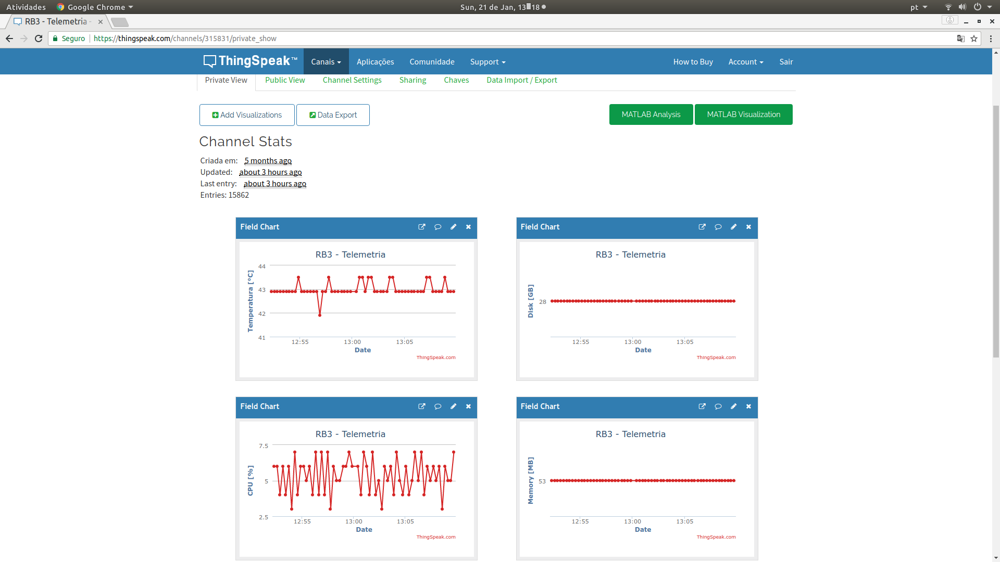
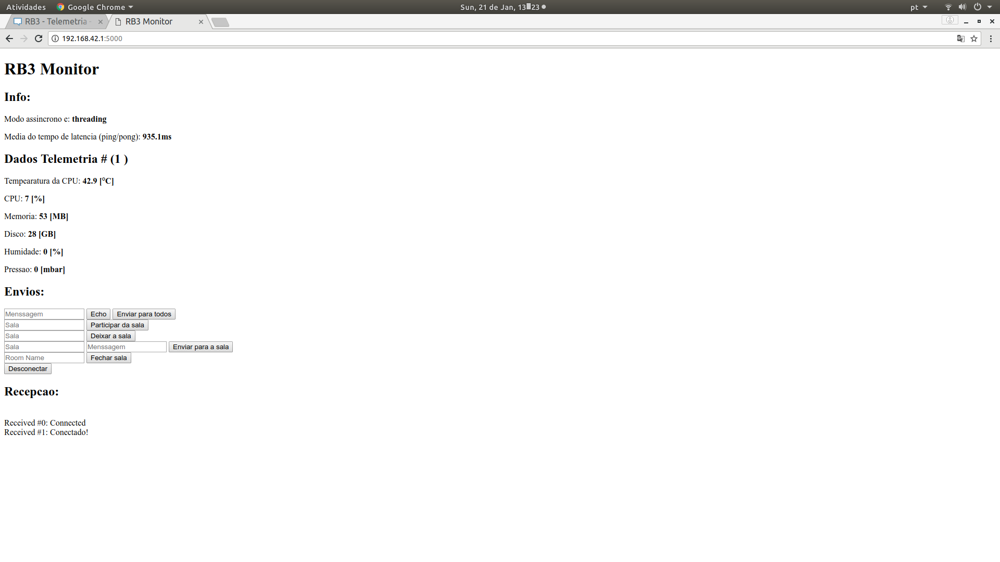

## Descrição

Publica mensagens com a telemetria da raspberry(Consumo de CPU,Memoria etc) na plataforma iot ThingSpeak o frontend é atualizado atrves de socket. Foi utilizado o framework Flask. 

Abaixo segue a tela sendo atualizada via socket 

## Instalação

1. Providenciar um ambiente python

2. Instalar dependênncias 

## Referencias

[Tutorial raspberry as webserver](https://projects.raspberrypi.org/en/projects/python-web-server-with-flask/10)

[Introdução MQTT ](https://www.mathworks.com/help/thingspeak/mqtt-basics.html#zmw57dd0e21035)

[websocket with Flask](https://blog.miguelgrinberg.com/post/easy-websockets-with-flask-and-gevent)